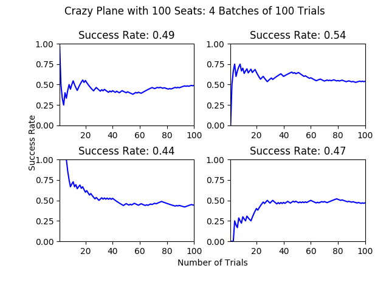

# The Crazy Guy on the Plane Brainteaser

**Problem Statement**
Imagine there are a 100 people in line to board a plane with 100 seats, and for convenience sake let's say that person 1 has the ticket to seat 1, person 2 to seat 2, and so on. The first person in line realizes he lost his boarding pass, so when he boards he decides to take a random seat instead. Every person that boards the plane after him will either take their "proper" seat, or will choose a random seat if theirs is already occupied. What is the probability that the *last person to board the plane will end up in seat 100, his/her correct assigned seat.*

This is a problem you can find stated in many places, [including but not limited to here](http://math.stackexchange.com/questions/5595/taking-seats-on-a-plane). Some goals that I have in this repo:

* Write a generic function `plane_process`that emulates this seating process with a plane of arbitrary size N.
* Use this function to repeat K trials of this process with a given plane size N and plot out the cumulative probability of success. 
	* Below you can find sample output from the most recent time I ran this code locally:
	
	
* Perhaps write a similar graphing function that shows how the probability of success fluctuates with plane size N (or doesn't fluctuate, as the case may be)

Implemented in Python 3.6.0
