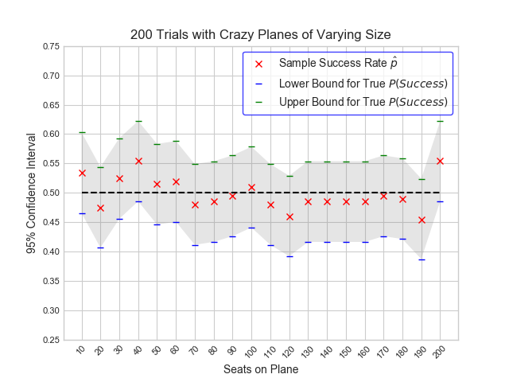

# The Crazy Guy on the Plane Brainteaser

**Problem Statement**
Imagine there are a 100 people in line to board a plane with 100 seats. For convenience sake let's say that person 1 has the ticket to seat 1, person 2 to seat 2, and so on. The first person in line realizes he lost his boarding pass, so when he boards he takes a random seat instead. Every person that boards the plane after him will either take their "proper" seat, or will choose a random seat if theirs is already occupied. What is the probability that the *last person to board the plane will end up in seat 100, his/her correct assigned seat?*

This is a problem you can find stated in many places, [including but not limited to here](http://math.stackexchange.com/questions/5595/taking-seats-on-a-plane). Some goals that I have in this repo:

* Write a generic function `plane_process`that emulates this seating process with a plane of arbitrary size N.
* Use this function to repeat K trials of this process with a given plane size N and plot out the cumulative probability of success (i.e. how many times out of K does the last passenger end up in the correct seat?). Right now, this is what's going on when we run `K_trials_planesize_N`. 
	* Below you can find sample output from the most recent time I ran this code locally:
	
	* Even with just 100 trials, we can start to see this probability converge to 50 percent. But that behavior would be clearer as we ramp up to 250, 500, 1000 trials.
	* **It would be nice** to create something interactive that allows someone to pick the number of trials, rerun the simulation, and graph out the cumulative results in real time.
	
* Write a similar graphing function that shows how the probability of success fluctuates with plane size N (or doesn't fluctuate, as the case may be). This is the idea behind `K_trials_variable_N`.
	* Here's sample output from the last commit I made. We run a fixed number of trials on planes with 20 different sizes, and use that to construct a confidence interval around the success proportion for those files.  I'm also plotting a null hypothesized probability of 50 percent.
	
	* Regardless of the number of seats on the plane, very few of these confidence intervals rule out 50 percent as the "true" probability of success for this plane experiment.
	* This seems like **another place** where tooling around with the number of trials would yield a visual result: confidence intervals would "close in" on 50 percent as we have "more evidence" to build them with

Potential Goals/Questions/Future Directions
- Make this a blog post about the virtues of simulation/making computers do stuff for you
- Turn these static visuals into something that people can twiddle around with to a certain degree to see how convergence improves, or something that animates over time
	- Example of latter: [Sensor Fusion Blog Post](https://datascopeanalytics.com/blog/sensor-fusion-tutorial/)
- Wrap in more "real-world" examples of using simulations to solve problems; one that comes to mind is rejection sampling for estimating the value of pi.
- _Open to ideas_ about more compelling visualizations (I could probaly Seaborn them to make them prettier...)
