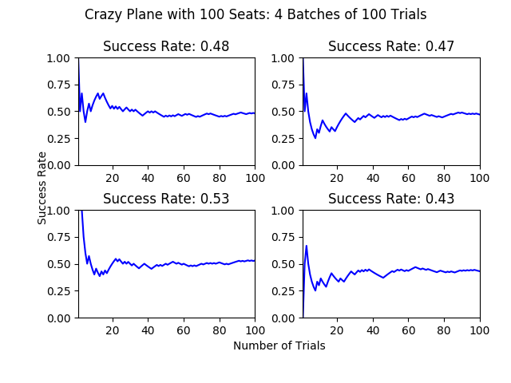
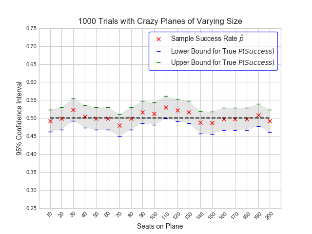

#Flipping a Coin on a Crazy Plane
I'm a big fan of brain teasers and happen to find quirky, counterintuitive mathematical truisms fascinating. I'd be lying to you if I said I hadn't spent a weekend figuring out why it is that 23 people in a room [are more likely than not to generate at least one shared birthday.](https://en.wikipedia.org/wiki/Birthday_problem) At the same time, I don't consider myself particularly "good" at brainteasers. Put another way, I'd certainly experience a good deal of stress if confronted with a [Die Hard 3 scenario](https://www.youtube.com/watch?v=BVtQNK_ZUJg), even if Samuel L. was there to help me...

The good news is there's a fairly simple way to improve skill at something you may not be a "natural" at: practice it, just you might jog up stairs or run for long distances to build up stamina. But imagine if instead of having regular old running shoes, you had turbo-charged, bionic shoes that made it easier for you to run farther and push your distance limits. You'd build up your stamina for sure, and you might even run to parts of your neighborhood or city that you'd never explored before and see something cool.

While these turbo-shoes don't exist last time I checked, as a Data Scientist I can tell you that an analog to them exists when it comes to generating insights about a wide array of complex systems, from physical and biological processes and financial investments to winning your favorite board game or solving a little brainteaser. What's more, you already have everything you need to use this tool assuming you're reading this post from a computer.

What is this mysterious treasure I speak of? **Simulation!**

In my humble opinion, one of the "killer apps" of taking a data science-y approach to problem solving is as follows: "let computers do as much of your dirty work for you." Setting up a quick simulation is one of the best examples of this principle at work: figure out what game you want to play, tell your computer the rules, and then have it play that game over and over again while aggregating the results in an easy-to-interpret format. This provides a way to tackle problems that are prohibitively complex and gain a good understanding of "long-run" phenomena, all while making a much better use of your time (unless you happen to be in the position to, say, [flip a coin 10,000 times](https://en.wikipedia.org/wiki/John_Edmund_Kerrich)).

In this post, I want to give a quick demonstration of how trading the pen and paper for a little bit of Python helped me work out a brainteaser that I like to refer to as "The Crazy Plane Problem:"

Imagine there are a 100 people in line to board a plane with 100 seats. For convenience, let's say that person 1 has the ticket to seat 1, person 2 to seat 2, and so on. Unfortunately, the first person in line is crazy and simply takes a random seat instead of looking at his ticket. Every person boarding after him will either take the "proper" seat, or will choose a random seat if his/hers is already occupied. What is the probability that _the last person to board the plane will end up in seat 100, his/her correct assigned seat?_

If you looked at the problem above for a little while and didn't instantly see a way to "math it out," but didn't want to just google the answer, then there's no need to ask your doctor about simulation because I already know it's right for you! All we need to do now is take four steps:

1. Formulate a hypothesis
2. Code out an experiment
3. Run experiment/gather data
4. Aggregate data and test hypothesis

##Forumlating our hypothesis
As is the case with many of the problems we deal with here at Datascope, my first plan of attack was to pick up a pen and draw some things out. Before tackling the 100-seat plane specified in the problem, I wanted to sketch out some trials with smaller planes just to get a sense of the scenario we're dealing with. Consider a tiny plane with just two seats and two passengers. When the first passenger chooses randomly, he'll either sit in his assigned seat or in the target passenger's seat, leaving the target passenger with a 50/50 shot of finding her seat unoccupied.

*TKTK Display scan of hand-drawn probability tree with just two passengers*

We can draw out similar scenarios for planes with three seats and four seats. Every row in these diagrams represents the possible seat choices that the 1st, 2nd, ... nth passenger can make, given all choices already made by previous passengers.

*TKTK Display two scans of hand-drawn probability trees with n = 3 and n = 4 passengers*

In looking at these base cases, a couple of things stand out to me:

* The last passenger on the plane only ever ends up in his/her seat or in the crazy guy's seat. If one of the middle passengers "undoes" the crazy passenger's error by randomly selecting the crazy guy's seat, then everything else goes off without a hitch.  
* The probability that the last passenger gets the correct seat is 1/2 for all of these small planes. This gives us some evidence that the probability of "success" in this boarding experiment _may not depend_ on the number of people boarding the plane. In other words, **Hypothesis Achievement Unlocked:**  

**HYPOTHESIS:** The probability that the crazy plane's final passenger ends up in the correct seat is 50 percent, regardless of how many people are boarding the plane. 

We now have some inkling of what will happen if we ramp up from our "tiny planes" to our full 100-seat crazy plane, which is great. Unfortunately, drawing out these tree diagrams for planes with more passengers quickly becomes intractable. I'd be lying if I said I didn't while away certain hours of the evening drawing diagrams for 5- and 6-passenger planes, but even I don't even want to think about what the diagram for 100 passengers would look like. [ref]Especially considering that the 100-passenger diagram would have $2\super{99}$, or about _634 octillion_ branches to draw.[/ref]

##Simulating a Crazy Plane
But here comes the good news: we don't _have_ to think about the 100-passenger diagram or calculate out all the ways in which passengers' choices might be mucked up by prior randomness. Instead, we can move on to step 2 and let a little bit of code do that work for us. Here's just one way of turning this brainteaser into an easily repeatable function: 

[THINK ABOUT PASTING IN COMMENTS HERE AS WELL]
	```python
	import numpy as np

	def plane_process(N):
		'''
		Performs one trial of the "crazy plane" experiment
		for a plane with N seats
		'''
		passengers = [b for b in range(1, N + 1)]
		seats = [b for b in range(1, N + 1)]

		for passenger in passengers[:-1]:
			if passenger == 1:
	  			seats.remove(np.random.choice(seats,1).item())
			else:
				try:
					seats.index(passenger)
				except ValueError:
					seats.remove(np.random.choice(seats,1).item())
				else:
					seats.remove(passenger)
			passengers.remove(passenger)

		return 1 if passengers == seats else 0
	```

We simulate passengers boarding the crazy plane by creating two identical lists representing the numbered passengers and their corresponding assigned seats. In the `for` loop, we board all passengers except the final one. As passengers take seats, the chosen numbers are removed from _both_ lists. We know that the first passenger will always choose a seat randomly, so we make sure of that. Thereafter, each passenger tries to look up his or her seat, but will _also_ choose randomly if that seat already been occupied. Once all these choices have been made, we look at the last passenger and the last seat to see if there's a match, returning 1 for success and 0 for failure.

Voila! You now have a way to simulate the crazy plane process for any size plane you like. Put another way, we have set up a means to easily conduct an individual _"trial"_ of the crazy plane _"experiment"_. Looks like it's time to move on to step 3...

##Lather, Rinse, Repeat
In the last section, we introduced some key terms for our experiment.

* N - We've specified that our plane has a certain number of seats
* "Success/Failure" - Label the trial with a 1 if last passenger gets the right seat, 0 otherwise

As we prepare to run this experiment over and over again, it's helpful to reflect on _why it's helpful to do this._ As made clear in the brainteaser, the crazy plane process is chock full o' randomness, which can best be defined as anything that's _unpredictable over the short run but predictable in the long run_ (just like rolling dice, flipping coins, or drawing cards).  While we can't know for sure whether an inidividual crazy plane experiment will end in success or failure, we do know that  

- All trials observe the same rules regarding whether passengers will or won't take their assigned seats, and
- The outcome of each individual trial has _no effect_ on future trials. Every time we run the simulation again, the slate gets wiped clean and the chances of success versus failure are the same as they were in previous simulations.

These points help us zero in on what probability theorists mean by "predictable in the long run."  The best way to get an understanding of random processes is to observe their behavior in many, many repeated trials. In fact, a result known as the [Law of Large Numbers](https://en.wikipedia.org/wiki/Law_of_large_numbers) stipulates that the _more_ repeated trials we observe, the better we'll be able to understand a random process. Enter the usefulness of computer simulations at the core of this whole discussion: they simply allow you to generate enough experimental results in a short enough time to see the Law of Large Numbers in action!

With that in mind, let's take a look at what happens if we simulate the long-run behavior of the 100-seat crazy plane. Each graph below shows the cumulative success rate ($\frac{number of successful trials}{number of total trails})of running the process 100 times.



Notice that to the leftmost region of each of these graphs (where the number of trials is still small), the blue line representing cumulative success rate fluctuates a lot, because random processes are "unpredictable over the short term."  As we get closer to the full 100 trials, that fluctuation becomes much less pronounced and we zero in on our hypothesized success rate of 50 percent. There's some variability of final cumulative success rates in each of the four "batches of experiments" above: we're generally within five percentage points of 50 percent, but don't hit it on the nose.  How might this change if we bumped up the number of trials? Because we have code, this is an easy question to answer!


Once we increase the number of trials in these batches of simulations, the result of each of these batches is _pretty darn close_ to 50 percent. You can get a sense from looking at the far-right portion of each graph that these cumulative success rates have more or less flatlined. Put in a more general way: as we increase the "length" of what we consider the "long run", the impact of each individual experiment is minimized and we're left with a clearer picture of what's actually going on at scale. 

So without even cracking open a combinatorics textbook, we're able to take our 100-seat crazy plane, simulate the boarding process thousands of times, and get visual confirmation that the answer to the brainteaser is 50 percent. Those of you with some statistics familiarity may be cringing somewhat at my use of terms like "pretty darn close" and "visual confirmation" or might not be convinced that we have enough evidence to consider this brainteaser solved. Then cheer up, because the next section on this post will give you a technique to...

##Have Some Confidence!
At this point I'd also like to take the opportunity to return to one part of our hypothesis that we haven't addressed directly yet

**HYPOTHESIS:** The probability that the crazy plane's final passenger ends up in the correct seat is 50 percent, **regardless of how many people are boarding the plane.**   

We're not just interested in the plane with 100 seats, but potentially a plane with any number of seats you care to load up with people of questionable sanity! Luckily for us, the code we wrote above is easily adaptable to a plane of any size, which makes it easy for us to repeat the above simulations for these new planes and see whether our hypothesis bears out. As I prepare for this, I'm frankly tired of writing "cumulative success rate" over and over again, so I'm going to do what statisticians do in this situation and use a symbol instead

[FIX MARKDOWN IN GitHub]

* $\hat{p}$ - "p hat," where the p stands for probability, and the hat is just a notation to symbolize that we get this probability from a _sample_. In this case, that sample is one of our batches of repeated simulations.

We're using these simulations and calculating these $\hat{p} values to get a sense of what the actual "long run" probability underpinning our plane process is. I'm going to signify this concept as follows.

* $P(Success)$ - The true probability of any individual experiment producing a success.

Given that our plane process is random, the only way we'd be absolutely sure of knowing that true probability of success is to run infinite trials of an experiment (FLIP INFINITE COINS, SIMULATE INFINITE PLANES**) Introduce the concept of getting information about a 'parameter' from a sample, and how a confidence interval is a set of instructions for doing that

I would try and not say too much more about confidence intervals here, particularly given that there are a couple of ways one can go about doing this when estimating proportions or success rates (maybe in a nerd citation you can mention that you are using score intervals)


The confidence intervals will get narrower as we use more data (i.e. more simulations to build them)



##A Celebration of Simulation
What we just did provides a quick glimpse into an computational approach called "Monte Carlo methods," which is honestly just a fancier term for using repeated random sampling to solve problems. Quickly provide links to some other examples 

* Rejection sampling to estimate the value of $\pi$
* Monte Carlo simulations to [program AI for various popular games](https://jeffbradberry.com/posts/2015/09/intro-to-monte-carlo-tree-search/)
* TKTK find links for other use cases, or ask Datascopers if they know of approachable examples


We demonstrated a simulation-based approach to solving a tidy little brainteaser that, if you weren't as stubborn of a nerd as I am, you probably could have just googled and found a litany of answers, explanations, and analytic solutions for.  However, even with a simple hypothetical puzzle like this one, it's easy to add degrees of complexity to the situation.  As just a couple examples...

* What if there were not just one crazy passenger who defaults to a random seat, but two, three, or some other number of crazy passengers?
* What if those crazy passengers were not at the front of the boarding line, but were instead dispersed randomly throughout it
* What if a passenger randomly choosing a seat was more likely to choose certain seats than others? (i.e., perhaps the initial crazy person is less likely to run to the back of the plane and take seat 100 than she is to take a seat nearby, or any passenger finding his/her seat taken will choose the _nearest_ unoccupied seat)

Minor tweaks like this might be very difficult to work into an analytic solution to the problem. On the other hand, it's comparatively easy to tweak the code we laid out above to accomodate any or all of the scenarios above, run a couple hundred or couple thousand more trials, and see how our inference changes. Simulations are such a powerful problem solving tool because they customize and generalize to new scenarios relatively easily. Now that you've explored one particular framing of the "crazy plane" problem and have some basic code to simulate the process, you have all the raw materials you need to forumlate and test new hypotheses. No advanced training in statistics or combinatorics required!

In short, the next time you see a problem that you're not sure how to calculate (or perhaps just don't want to calculate), see if you can simulate! And what's more, simulate with pride, knowing that you're taking advantage of one of the most powerful approaches in the data scientist's tool belt.


